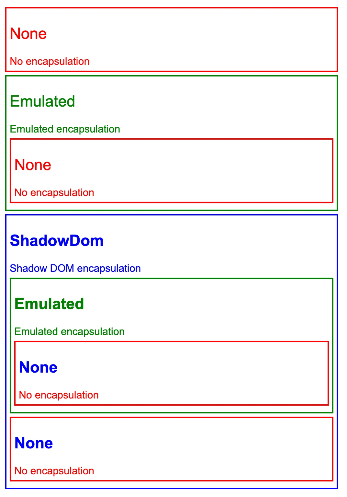
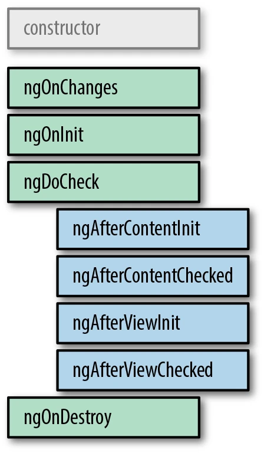

# Exercici 6 – Teoria de components. (1.5 punts)

## 6.1

Angular promou l'encapsulació i l'aïllament dels estils. Per defecte, els estils que es defineixen i s'utilitzen en un component no afecten a cap altre component, pare o fill.

Es pot configurar mitjançant l'atribut `encapsulation` del decorador `Component`. L'atribut `encapsulation` pren un dels tres valors:

* `ViewEncapsulation.None` Utilitza CSS global, sense cap encapsulació.
```ts
@Component({
  standalone: true,
  selector: 'app-no-encapsulation',
  template: `
    <h2>None</h2>
    <div class="none-message">No encapsulation</div>
  `,
  styles: ['h2, .none-message { color: red; }'],
  encapsulation: ViewEncapsulation.None,
})
export class NoEncapsulationComponent {}
```
Fitxer: `src/app/no-encapsulation.component.ts`
* `ViewEncapsulation.Emulated` Aquest és el valor predeterminat, on Angular crea CSS ajustat per emular el comportament que proporcionen Shadow DOM i shadow roots.
```ts
@Component({
  standalone: true,
  selector: 'app-emulated-encapsulation',
  template: `
    <h2>Emulated</h2>
    <div class="emulated-message">Emulated encapsulation</div>
    <app-no-encapsulation></app-no-encapsulation>
  `,
  styles: ['h2, .emulated-message { color: green; }'],
  encapsulation: ViewEncapsulation.Emulated,
  imports: [NoEncapsulationComponent],
})
export class EmulatedEncapsulationComponent {}
```
Fitxer: `src/app/emulated-encapsulation.component.ts`
* `ViewEncapsulation.ShadowDom` Angular utilitza l'API Shadow DOM integrada del navegador per incloure la vista del component dins d'un ShadowRoot, utilitzat com a element amfitrió del component, i aplicar els estils proporcionats de manera aïllada.
```ts
@Component({
  standalone: true,
  selector: 'app-shadow-dom-encapsulation',
  template: `
    <h2>ShadowDom</h2>
    <div class="shadow-message">Shadow DOM encapsulation</div>
    <app-emulated-encapsulation></app-emulated-encapsulation>
    <app-no-encapsulation></app-no-encapsulation>
  `,
  styles: ['h2, .shadow-message { color: blue; }'],
  encapsulation: ViewEncapsulation.ShadowDom,
  imports: [NoEncapsulationComponent, EmulatedEncapsulationComponent],
})
export class ShadowDomEncapsulationComponent {}
```
Fitxer: `src/app/shadow-dom-encapsulation.component.ts`



Com que els estils de `ShadowDomEncapsulationComponent` s'afegeixen a shadow host després dels estils globals, l'estil `h2` substitueix l'estil de `NoEncapsulationComponent`. El resultat és que l'element `<h2>` del `NoEncapsulationComponent` és de color blau en comptes de vermell, cosa que pot ser que no fos el que pretenia l'autor del component.

[Més informació](https://angular.io/guide/view-encapsulation)

## 6.2

El concepte de Shadow DOM naix de la necessitat de tenir una forma d'encapsular els elements i mantenir-los aïllats de la resta de la pàgina, creant així el concepte local, en contraposició al concepte global amb què solen treballar als navegadors.

Shadow DOM és una funcionalitat que permet al navegador web renderitzar elements DOM sense la necessitat d'inserir-los a l'arbre principal DOM del document. Això crea una barrera entre el que el desenvolupador i el navegador poden aconseguir; el desenvolupador no pot accedir a Shadow DOM de la mateixa manera que ho faria amb els elements niats, mentre que el navegador pot renderitzar i modificar aquest codi de la mateixa manera que ho faria amb els elements niats.

La conseqüència d'això és que per al CSS inclòs al Shadow DOM d'un element en particular, els elements HTML poden ser encapsulats sense el risc de què els estils CSS se filtrin i afectin als elements que no se suposa que haurien d'estar afectats. Tot i que aquests elements estan encapsulats en HTML i CSS, encara poden disparar esdeveniments que poden ser reconeguts per altres elements del document.

[Més informació](https://developer.mozilla.org/en-US/docs/Web/API/Web_components/Using_shadow_DOM)

## 6.3

`changeDetection` és un atribut del decorador `Component`, que estableix la manera en què Angular actualitza els components de la interfície gràfica. 

## 6.4

En el mecanisme ChangeDetectionStrategy.Default, cada vegada que Angular detecta un esdeveniment, recorrerà cadascun dels components de l'arbre de components i comprovarà individualment cadascun dels vincles per veure si algun dels valors ha canviat i necessita actualitzar-se a la vista.

La detecció de canvis té un gran rendiment, però a mesura que una aplicació es fa més complexa i la quantitat de components creix, la detecció de canvis haurà de treballar cada cop més. En una aplicació molt gran pot ser que una pàgina tingui molts vincles. Quan un usuari fa alguna acció, generalment no es canvia la major part de la pàgina. En aquests casos, es pot donar una indicació al detector de canvis d'Angular perquè comprovi o no certs components. Per a qualsevol component donat, només cal canviar ChangeDetectionStrategy, del valor predeterminat a ChangeDetectionStrategy.OnPush. Això diu a Angular que els vincles d'aquest component en particular només s'hauran de comprovar en funció de l'entrada d'aquest component.

Per exemple, en un arbre de components A → B → C. És a dir, tenim un component arrel A, que utilitza un component B a la seva plantilla, que al seu torn utilitza un component C. I diguem que el component B es passa com un objecte compost `compositeObj` al component C com a entrada. Potser alguna cosa com:

```html
<c [inputToC]="compositeObj"></c>
```

* Si el component C té vincles a qualsevol atribut de `compositeObj`, funcionaran com sempre (sense canvis respecte al comportament predeterminat).
* Si el component C fa canvis en algun dels atributs de `compositeObj`, també s'actualitzaran immediatament (sense canvis respecte al comportament predeterminat).
* Si el component principal B crea un nou `compositeObj` o canvia la referència de `compositeObj`, aleshores el component C reconeixeria el canvi i actualitzarà els seus vincles per al nou valor (sense canvis respecte al comportament predeterminat, però el comportament intern canvia en com Angular reconeix el canvi).
* Si el component principal B canvia qualsevol atribut del `compositeObj` directament (com a resposta a una acció de l'usuari fora del component B), aquests canvis no s'actualitzaran al component C (canvi important respecte al comportament predeterminat).
* Si el component principal B canvia qualsevol atribut en resposta a un emissor d'esdeveniments del component C i a continuació canvia qualsevol atribut del `compositeObj` (sense canviar la referència),  encara funcionaria i els enllaços s'actualitzaran. Això es deu al fet que el canvi s'origina del component C (no hi ha canvis respecte al comportament predeterminat).

## 6.5
Els components (i les directives) tenen el seu propi cicle de vida a Angular, des de la creació, representació, modificació fins a la destrucció. Aquest cicle de vida s'executa en ordre de recorregut de l'arbre de preordre, de dalt a baix. Després que Angular representa un component, comença el cicle de vida de cadascun dels seus fills, i així successivament fins que es renderitza tota l'aplicació.

Hi ha moments en què aquests esdeveniments del cicle de vida ens són útils per desenvolupar la nostra aplicació, de manera que Angular proporciona ganxos en aquest cicle de vida perquè puguem observar i reaccionar segons sigui necessari. La següent figura mostra els ganxos del cicle de vida d'un component, en l'ordre en què s'invoquen.

| Interface       | Mètode | Propòsit |
| --------------- | ------ | -------- |
| `OnChanges`     | ngOnChanges(changes: SimpleChange) | `ngOnChanges` es crida just després del constructor per a l'establiment, i després cada vegada que canvien les propietats d'entrada d'una directiva. Es crida abans del mètode `ngOnInit`. |
| `OnInit`        | ngOnInit() | Aquest és el típic ganxo d'inicialització, que permet fer qualsevol inicialització específica d'un sol cop del component o de la directiva. Aquest és el lloc ideal per carregar dades del servidor i així successivament, en comptes del constructor, tant per a la separació de preocupacions com per a la comprovació. |
| `AfterViewInit` | ngAfterView​Init() | `AfterViewInit` és el complement d'`AfterContent​Init` i s'activa després que s'acabin d'inicialitzar tots els components secundaris que s'utilitzen directament a la plantilla del component i les seves vistes s'actualitzen amb vincles. Això no vol dir necessàriament que les vistes es representin al navegador, però que Angular ha acabat d'actualitzar les seves vistes internes per renderitzar-les el més aviat possible. `AfterViewInit` només s'activa una vegada durant la càrrega del component. |
| `OnDestroy`     | ngOnDestroy() | El ganxo `OnDestroy` es crida quan un component està a punt de ser destruït i eliminat de la IU. És un bon lloc per fer tota la neteja, com cancel·lar la subscripció a qualsevol oient que s'hagi inicialitzat i similars. En general, és una bona pràctica netejar qualsevol cosa que s'hagi registrat (temporitzadors, observables, etc.) com a part del component. |




